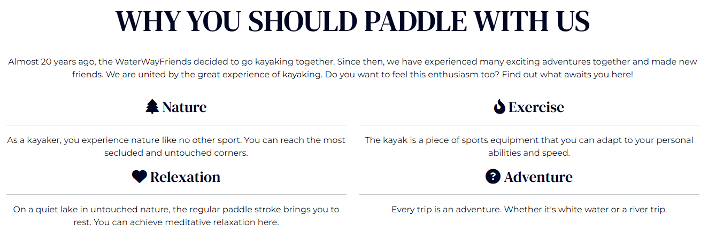
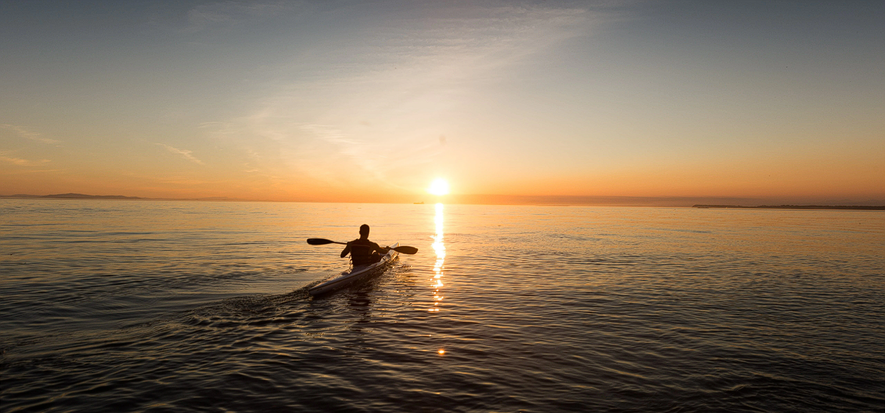

# **Kayak Community Page**
## **Site Overview**
WaterWayFriends is an open kayak community always on the lookout for new members and friends. The goal of the community is to bring kayak enthusiasts together and inspire new people to get excited about kayaking.
The community regularly organizes tours that focus on shared experiences. You can register for these tours on the website. Interested individuals can get an impression from pictures of past tours and testimonials from previous participants.
Additionally, the benefits of kayaking are highlighted, such as the experience of nature, its relaxing and almost meditative effect, as well as the physical training and the thrill of adventure.

## Table of contents:
1. [**Site Overview**](#site-overview)
2. [**Planning stage**](#planning-stage)
    * [***Target Audiences***](#target-audiences)
    * [***User Stories***](#user-stories)
    * [***Site Aims***](#site-aims)
    * [***How Is This Will Be Achieved:***](#how-is-this-will-be-achieved)
    * [***Wireframes***](#wireframes)
    * [***Color Scheme***](#color-scheme)
3. [**Features Common to all pages**](#features-common-to-all-pages)
    * [*Navigation Bar*](#navigation-bar)
    * [*Header Element Heading h1*](#header-element-heading-h1)
    * [*Footer*](#footer)
4. [**Features of specific pages**](#features-of-specific-pages)
    * [***Home page***:](#home-page)
      * [*Home page Header*](#home-page-header)
      * [*Hero-Carousel*](#hero-carousel)
        * [*Preview Image*](#preview-image)
      * [*About Us Section*](#about-us-section)
        * [*Why Paddle With Us*](#why-paddle-with-us)
      * [*Testemonial Section*](#testemonial-section)
    * [***Tours page***:](#tours-page)
      * [*Tours Page Header*](#tours-page-header)
      * [*Journeys in 2025 Section*](#journeys-in-2025-section)
    * [***Booking page:***](#booking-page)
      * [*Booking Header*](#booking-header)
      * [*Booking Form*](#booking-form)
    * [***Success page:***](#success-page)
      * [*Success Header*](#success-header)
      * [*Success Hero*](#success-hero)
      * [*More Adventurous Section*](#more-adventurous)
    * [**Anchor Tags Within all Pages Main Content**](#anchor-tags-within-all-pages-main-content)
    * [**Typography**](#typography)
5. [**Future-Enhancements**](#future-enhancements)
6. [**Testing Phase**](#testing-phase)
7. [**Deployment**](#deployment)
8. [**Credits**](#credits)
    * [**General reference**](#general-reference)
    * [**Content**](#content)
    * [**Media**](#media)

## **Planning stage**
### **Target Audiences:**
* Users who are looking for a new sport that is both relaxing and challenging.
* Users who have had their first contact with kayaking and want to learn more about it.
* Users who already kayak regularly and are now looking for a group to join for shared tours.
* Users who are already members of the WaterWayFriends community and want to stay informed about upcoming tours.

### **User Stories:**
* As a User, I want to find information quickly and efficiently without frustration.
* As a User, I need easy navigation, including a responsive layout for my device.
* As a User, I want to see high-quality images of past tours.
* As a User, I want to find contact details and social media links easily.
* As a user, I want to see upcoming tours and potential costs.
* As a User, I want to book a kayak tour.
* As a user, I want to read the opinions of participants.

### **Site Aims:**
* To show what the WaterWayFriends community is all about.
* To educate the user on the benefits of kayaking.
* To give the user the opportunity to become part of a community of kayak enthusiasts.
* To provide users with information about past tours, such as pictures and testimonials.
* To provide the user with information about upcoming tours and allow the User to make a booking.

### **How Is This Will Be Achieved:**
* The home page provides the user with information about kayaking and kayaking tours.
* The site will show the user high quality images of past tours.
* The site will explain the benefits of kayaking to the user.
* The site will provide users with opinions from participants of past tours.
* The site will show the user the upcoming tours. It will also provide detailed information about the tours.
* The site will allow the user to book one of the upcoming tours.
* The site will allow the user to become part of the WayWaterFriends Community.

### **Wireframes:**
I created wireframes for this project to organise my ideas and not lose focus. See the links below for the mobile and desktop versions of the four wireframes.

* Mobile Wireframes:
    * [Home page]
    * [Tours page]
    * [Booking page]
    * [Success page]

* Desktop wireframes:
    * [Home page]
    * [Tours page]
    * [Booking page]
    * [Success page]

### **Color Scheme:**
When choosing the colour scheme, I wanted a scheme that represented the element of water, while providing enough contrast for good readability. To generate the color palette I used https://coolors.co/. 
I chose a variaton of light blue as the primary colour and a variation of white as the background colour.
A test with Lighthouse then showed that this choice of color was not optimal from an accessibility perspective. I had to change the light blue I had originally planned to a much darker blue.
In the end, this was the better decision as it gave the site a much more elegant design.

## **Features Common to all pages**
###  **Navigation Bar**
* The navigation bar sticks to the top of the page as the user scrools up and down.
* It is displayed on all four pages with the same content.
* The name of the community is displayed on the left hand side.
* On the right hand side of the bar is a link to the About Us section of the home page, a link to the Tours page and a button that takes you to the Booking Form.
* The page a user is on is highlighted.

* On smaller devices such as mobile phones, the links are grouped into a hambruger button on the right side. The display of the community name remains the same.

Folded

Unfolded

### **Header Element Heading h1**
* The h1 heading of the header is the same on all pages and contains the name of the community (WaterWayFriends). 
* It stays the same on all devices.
  * Note that the paragraph content of the header is different on each page, as it briefly describes the content of that page.

### **Footer**
* The footer is always at the bottom of the page.
* It is displayed on all four pages with the same content.
* It contains all the contact details for the community.
* It provides links to the community's social media profiles.

Desktop view:

Mobile view:

## **Features of specific pages**

### **Home page**:
***
#### *Home page Header:*
* While the h1 "WayWaterFriends" stays the same through all pages, the other content of the header differs.
* The content of the home page header is a welcome to the user and a direct invitation to join the community on a tour.
* The header also includes a Book Now button to quickly take the user to the booking form.

#### *Hero-Carousel:*
* The hero carousel contains five images of past tours of the community that scroll through automatically. It is also possible to switch between the images using the corresponding arrow buttons on the left and right edges. To jump to a specific image, you can use the pipes at the bottom of the image.
* All the images are accompanied by a caption and a short text intended to convey a particular feeling. The focus is on experiencing nature together as a group on a kayak trip. 

##### *Preview Image:*

#### *About Us Section:*
##### *Why Paddle With Us*

#### *Testemonial Section:*
* The Testimonials section contains reviews from members and friends of the community. This is where they share their experiences from the tours they have done with the community in the past.
* The testimonial section consists of a picture of the reviewer and a quote from them.
* The individual reviews scroll automatically. However, this can also be controlled manually using the arrow buttons on the left and right edges.
* The testimonials give new users the opportunity to get a better idea of ​​the community's tours.
* The Book Now button, located directly below the quote, allows users to jump directly to the booking form if they are convinced by the testimonials.

Desktop view:

Mobile view:

### **Tours page**:
***
#### *Tours Page Header:*

* The header of the tours page tells the user what to expect on that page. It also tells the user that each tour starts from the WaterWayFriends clubhouse.

#### *Journeys in 2025 Section:*

* This section shows all upcoming tours.
* Each tour is presented with a representative image and some information about the tour.
* The information includes a description of the water type, level of difficulty rating and dates.
* Each tour description has its own "Book now" button, which takes the user directly to the booking form if they are interested in one of the tours.
* In the desktop view, the image and the corresponding description of a tour are displayed side by side.
* In mobile view, the image, description and the "Book now" button are displayed one below the other.

Desktop view:

Mobile view:

### **Booking page:**
***
#### *Booking Header:*

* The header of the booking page describes the content of the page.
* It helps the user understand how to successfully complete the form.

#### *Booking Form:*

### **Success page:**
***
#### *Success Header:*

* The header of the success page contains a thank you for booking a tour and informs the user about the next step.

#### *Success Hero:*

* The image of a kayak sailing into the sunset symbolises the successful completion of registration.

#### *More Adventurous Section:*

* This section encourages the user, after successfully registering for a tour, to visit the tour page regularly to discover other interesting tours.
* The text also contains a hyperlink to the tour page.

***
## **Typography**
* Two Fonts are used throughout the Page:
  * DM Serif Text -> for all headings
  * Montserrat -> for all text content
  
## **Future-Enhancements**

***
## **Testing Phase**
I have documented the testing processes, both during and after development, in a separate file named [TESTING.md](TESTING.md).
***
## **Deployment**
I deployed the page on GitHub pages via the following procedure: -

1. From the project's [repository](https://github.com/ksstrat/milestone-project-1), go to the **Settings** tab.
2. From the left-hand menu, select the **Pages** tab.
3. Under the **Source** section, select the **Main** branch from the drop-down menu and click **Save**.
4. A message will be displayed to indicate a successful deployment to GitHub pages and provide the live link.

You  can find the live site via the following URL - [WaterWayFriends](https://ksstrat.github.io/milestone-project-1/index.html)
***
## **Credits**

### **General reference:**
* The project drew inspiration from the Code Institute's code-along projects, Love Running and Boardwalk Games. Although I aimed to deviate as much as possible, there may still be some similarities in the code structure.
* Throughout the project, I used Bootstrap Docs, W3Schools and MDN Web Docs as primary resources for guidance and reference.

### **Content:**
* All content was created and written by me.
* For this project I have been using the Bootstrap library [Bootstrap](https://getbootstrap.com/)
* The Icons in the about us section and the footer were taken from [Font Awesome](https://fontawesome.com)
* All fonts were imported from [Google Fonts](https://fonts.google.com/)

### **Media:**
* Carousel Image 1 (carouselheader1.webp) - [pixabay.com](https://pixabay.com/de/photos/m%C3%A4dchen-kajak-see-kanu-kajakfahren-1561989/)
* Carousel Image 2 (carouselheader2.webp) - [pixabay.com](https://pixabay.com/de/photos/kanu-wasser-fluss-boot-kajak-2920401/)
* Carousel Image 3 (carouselheader3.webp) - [pixabay.com](https://unsplash.com/photos/person-in-red-shirt-riding-on-boat-on-lake-near-mountain-during-daytime-99eRQ-us59U)
* Carousel Image 4 (carouselheader4.webp) - [pixabay.com](https://pixabay.com/de/photos/kajak-see-b%C3%A4ume-natur-koniferen-7432917/)
* Carousel Image 5 (carouselheader5.webp) - [pixabay.com](https://pixabay.com/photos/rock-formation-cave-geology-3950774/)
* Testimonal Man 1 (placeholder-testemonial.webp) - [pixabay.com](https://pixabay.com/photos/man-coffee-outdoors-lake-lakeside-3803551/)
* Testimonal Man 2 (testemonial2.webp) - [pixabay.com](https://pixabay.com/photos/happy-man-adult-city-face-guy-1836445/)
* Testimonal Woman (testemonial3.webp) - [pixabay.com](https://pixabay.com/photos/woman-kayak-rowing-boat-water-7123962/)
* Nordwald River (upcomingtour1.webp) - [pixabay.com](https://pixabay.com/photos/river-forest-trees-nature-7415159/)
* Lake Emerald (upcomingtour2.webp) - [pixabay.com](https://pixabay.com/photos/emerald-lake-kayak-mountains-canoe-7029581/)
* White River (upcomingtour3.webp) - [pixabay.com](https://pixabay.com/photos/river-trees-mountains-water-flow-5662292/)
* Success Page Hero (successimg.webp) - [pixabay.com](https://pixabay.com/photos/boat-sunset-kayaking-dusk-nature-8548568/)
* Color Scheme Tool - [coolors](https://coolors.co/)
* Font Awesome Icons - [Font Awesome](https://fontawesome.com)
* Bootstrap Library - [Bootstrap](https://getbootstrap.com/)
