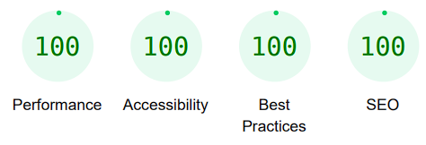

## Table of Contents
* [**Testing Druing Development**](#testing-during-development)
    * [*Manual Testing*](#manual-testing)
    * [*Bugs and Fixes*](#bugs-and-fixes)
* [**Post Development Testing**](#post-development-testing)
  * [**Validators**](#validators)
      * [*HTML*](#html---httpsvalidatorw3org)
      * [*CSS*](#css---httpsjigsaww3orgcss-validator)
  * [**Lighthouse Scores**](#lighthouse-scores)
      * [*Desktop Testing:*](#desktop-testing)
      * [*Mobile Testing*](#mobile-testing)

## **Testing During Development**
While developing, I've manually tested using the following methods:

1. I manually tested each element for appearance and responsiveness by using a VSCode extension called 'Live Server' to start a local server and then testing my project mainly in the Chrome browser.
    
2. I published the page using GitHub pages and shared the link with friends, including many developers, to test and get feedback.

### ***Manual Testing:***
* To ensure cross-compatibility, I tested the project on four different browsers. The desktop browsers I utilized included:

  1. Chrome
  2. Firefox  
  3. Vivaldi
  4. Safari

* I utilized the browser's developer tools to simulate various screen sizes and devices, ranging from mobile (320 px in width) to Ultra Wide Screens (4000 px in width)." 
* I also asked several people with different android and iphone mobile phones to test the site as well.

### ***Bugs and Fixes:***

During the development process, I identified the following bugs through manual testing:

1.  * ***Issue:*** 
        * The footer was not sticking to the bottom of the page
    * ***Solution:*** 
        * Added classes "d-flex" "flex-column" and "min-vh-100" to body element
        * Added class mt-auto to footer element

2.  * ***Issue:*** 
        * Contrast between primary color #7FC8F8 Light Sky Blue and background color #F9F9F9 Seasalt not sufficient.
    * ***Solution:***
        * Switcht primary color to #000723 Oxford Blue.

3.  * ***Issue:*** 
        * The bootstrap class “display” was set to the value 2 for the header h1. This caused problems in the responsive view.
    * ***Solution:***
        * Display classe was set to the value 4.

4.  * ***Issue:*** 
        * On index.html, the screen could shake on small devices because the testimonial section element text hight differed to much.
    * ***Solution:***
        * Fixed height set for the texts of the tesimonial card (280px).

5.  * ***Issue:*** 
        * On index.html, the screen could shake on small devices because the testimonial section element text hight differed to much.
    * ***Solution:***
        * Fixed height set for the texts of the tesimonial card (280px).

6.  * ***Issue:*** 
        * The images of the elements in the testimonial section varied too much in size. The face should be the highlighted element in the circle.
    * ***Solution:***
        * Set a fixed height of 240px and width of 320px to secure that all testimonial faces are centered in the circle.

7.  * ***Issue:*** 
        * On booking.html the text of the switch element protruded over the right side of the screen on mobile phones.
    * ***Solution:***
        * Added bootstrap class mx-auto the the element.

## **Post Development Testing**
### **Validators**

#### ***HTML*** - https://validator.w3.org/
***

#### ***index.html***

* No error or warning was found during the validation of index.html. However, there was a "Info" that was also displayed on all my other pages:

* I couldn't remember setting a slash for elements without a closing tag. After a quick check, I found out that the VSCode extension Prettier, which I had used to quickly format the hmtl code, sets this slash.
* I then removed the slashes in elements without a closing tag on all pages.

#### ***tours.html***

* No error or warning was found during the validation of tours.html

#### ***booking.html***

* No error or warning was found during the validation of booking.html

#### ***success.html***

* No error or warning was found during the validation of success.html

#### ***404.html***

* No error was found during the validation of 404.html

* *Warning Found*

     

* *Solution*
    * Changed the section to div because no structure or heading was needed and the only content was an image

### ***CSS*** - https://jigsaw.w3.org/css-validator/
***

* No error was found during the validation of style.css

* *Warning Found*

    

* All three warnings were directly related to the use of Google Fonts.
* Since these imported style sheets are not checked by the w3c css validator, it issues a warning.
* No change is required here.

### **Lighthouse Scores**
***
### **Test conditions**
* All of the Lighthouse tests were run in the Chrome browser using the developer tools in incognito mode.
* Both desktop and mobile tests were conducted
 
#### ***Desktop Testing:***
***

* The Lighthouse Score for desktops regarding "Accessibility", "Best Practices" and "SEO" is for all Pages 100 or near 100.
* Performance is 90+ to 100. This is mainly due to larger images.
* There is no need for action here, as a score above 90 is considered by Google to be good and safe for the user experience.

#### ***index.html***

#### ***tours.html***

#### ***booking.html***

#### ***success.html***

#### ***404.html***

#### ***Mobile Testing:***
***

* The Lighthouse score for mobile regarding "Accessibility", "Best Practices" and "SEO" is for all Pages 100 or near 100.
* There are some differences in the performance score between the sites. I will discuss these below.

#### ***index.html***

* The performance of index.html is at 73, mainly due to high-resolution images.
* The largest factor is the "Largest Contentful Paint Element" (LCP). This measures the time it takes to render the largest content element. A moderate result would be 2.5-4ms. Because of the large images in the carousel index.html, the LCP takes 9,550 ms.
* Since high quality images of past tours play an important role for both users and the site's look and feel, compressing and thus degrading the images is not advisable.
* If the performance drops further in future measurements, the images must be compressed.

#### ***tours.html***

* The performance score of tours.html is 77, as this page also has larger images of upcoming tours.
* The LCP takes 6.5ms for tours.html and is therefore slow.
* As on index.html, high-resolution images also play an important role here.
* If the performance drops further in future measurements, the images must be compressed.

#### ***booking.html***

#### ***success.html***

#### ***404.html***

***

[return to README.md](README.md)